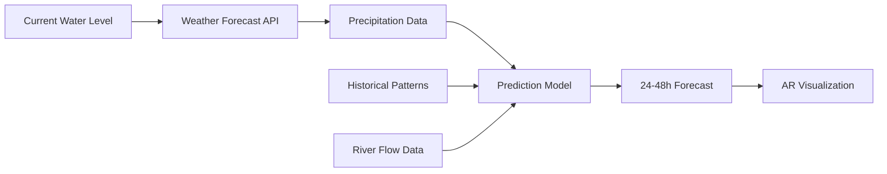

# Future Work

Planned features, improvements, and the roadmap for AR Flood Visualization.

## Vision

**Transform AR Flood Visualization from a proof-of-concept into a comprehensive flood preparedness and awareness platform.**

Our goal is to create a tool that:

- Helps people understand and prepare for flood risks
- Provides actionable insights for emergency situations
- Expands to broader audiences and use cases
- Integrates with official warning systems

## Roadmap

### Current Status

**Status:** Complete

- Functional AR visualization
- Real-time Pegelonline API integration
- GPS-based positioning
- Elevation data integration
- Floor level selection
- Demo mode for testing
- Basic UI and debug panel
- Android 11+ support
- Documentation

### Future Implementations

**Status:** In Planning

1. **Predictive Flood Modeling**
    - Integrate weather forecasts
    - Show predicted water levels (24-48h ahead)
    - Display multiple scenarios (best/worst/likely)
    - Time-based animation of water rise/fall
    - Alert users when critical thresholds expected

2. **Historical Data Overlay**
    - Show past flood events at current location
    - Compare current levels to historical floods
    - "Last time water reached this height: [date]"
    - Learning from past events

3. **Improved UI/UX**
    - Better onboarding tutorial
    - In-app help system
    - Accessibility improvements (larger text, high contrast)
    - Simplified mode for non-technical users

4. **Performance Optimization**
    - Reduce battery consumption
    - Faster data loading
    - Better AR tracking
    - Optimized for lower-end devices
    - Reduced app size

5. **Bug Fixes & Refinement**
    - Address user-reported issues
    - Improve error messages
    - Better handling of edge cases
    - Stability improvements

6. **Offline Mode**
    - Cache water level data
    - Download area data for offline use
    - Limited functionality without network
    - Sync when connection restored

7. **Notification System**
    - Push alerts for rising water levels
    - Customizable thresholds
    - Early warning for critical levels
    - Daily summary (optional)
    - Location-based alerts

8. **iOS Version**
    - Port to ARKit
    - iPhone/iPad support
    - Feature parity with Android
    - Cross-platform codebase optimization

### Ideas for Long-Term

1. **Evacuation Route Planning**
    - Integration with navigation apps
    - Show safe routes to high ground
    - Identify emergency shelters
    - Real-time route updates based on flooding
    - Community-contributed safe zones

2. **Social & Community Features**
    - Share flood observations
    - Report actual water levels
    - Crowdsourced data validation
    - Community warnings
    - Photo sharing of flood conditions

3. **Advanced Visualization**
    - Water flow animation (direction & speed)
    - Current and wave visualization
    - Debris/contamination indicators
    - Flood damage estimation
    - Before/after comparisons

4. **Multi-Hazard Support**
    - Storm surge visualization
    - Tsunami modeling
    - Heavy rain accumulation
    - Dam break scenarios
    - Coastal flooding

## Detailed Feature Plans

### Predictive Flood Modeling

**How It Works:**

**User Experience:**

1. See timeline slider (Now → +48h)
2. Drag slider to see future water levels
3. Color coding: Green (safe), Yellow (watch), Red (warning)
4. Automatic alerts if critical level predicted

**Data Sources:**

- Weather API (OpenWeatherMap, DWD)
- Pegelonline forecasts
- Historical pattern analysis
- Precipitation predictions

---

### Historical Data Overlay

**Features:**

- "On this day in [year], water reached [height]"
- Overlay historical max flood levels
- Show frequency of flooding at location
- 10-year, 50-year, 100-year flood levels
- Timeline of major flood events

**Data Sources:**

- Pegelonline historical data
- Local flood archives
- News reports of major floods

**UI Design:**

- Timeline scrubber
- "Show major floods" toggle
- Markers for notable events
- Comparison view (then vs now)

---

### Notification System

**Notification Types:**

1. **Critical Alerts**
    - Water approaching critical level
    - Immediate action recommended
    - Sound + vibration

2. **Warnings**
    - Water level rising
    - Monitor situation
    - Silent or low-priority

3. **Information**
    - Daily summary
    - Weekly forecast
    - Optional, can disable

**User Controls:**

- Set custom thresholds
- Choose notification types
- Location-specific settings

**Privacy:**

- All processing on-device
- No location tracking
- User controls all data

## Research & Exploration

### Areas for Investigation

1. **Improved Elevation Data**
    - LiDAR data sources
    - Satellite-based DEMs
    - Local surveying data
    - Crowdsourced corrections

2. **Hydraulic Modeling**
    - River flow simulation
    - Terrain-based water spread
    - Drainage system modeling
    - More accurate flooding patterns

3. **AR Improvements**
    - Better outdoor tracking
    - Persistent AR anchors
    - Multi-user AR (shared view)
    - Occlusion (water behind objects)

4. **Accessibility**
    - Voice guidance for visually impaired
    - Haptic feedback for warnings
    - Simple mode for elderly
    - Multi-language support

## Constraints & Challenges

### Technical Limitations

**GPS Accuracy:**

- ±5-20m horizontal error
- ±10-30m vertical error
- Difficult to improve significantly

**Elevation Data:**

- Limited by source resolution
- Trade-off: accuracy vs coverage
- May never be perfect

**AR Tracking:**

- Requires good lighting
- Outdoor environment best
- Can't work in all conditions

**Battery Life:**

- AR is power-intensive
- Hard to significantly improve
- Users must accept limitation

### Data Limitations

**Pegelonline Coverage:**

- Germany only
- Limited international expansion
- Dependent on government data

**API Reliability:**

- Not under our control
- Could change or be discontinued
- Need fallback options

**Real-time Updates:**

- Limited by API refresh rate
- Can't be truly instant
- 5-second minimum delay

## Next Steps

See also:

- [Motivation](motivation.md) - Why we're building this
- [Team](team.md) - Who's working on this
- [Hardware](hardware.md) - Hardware we use